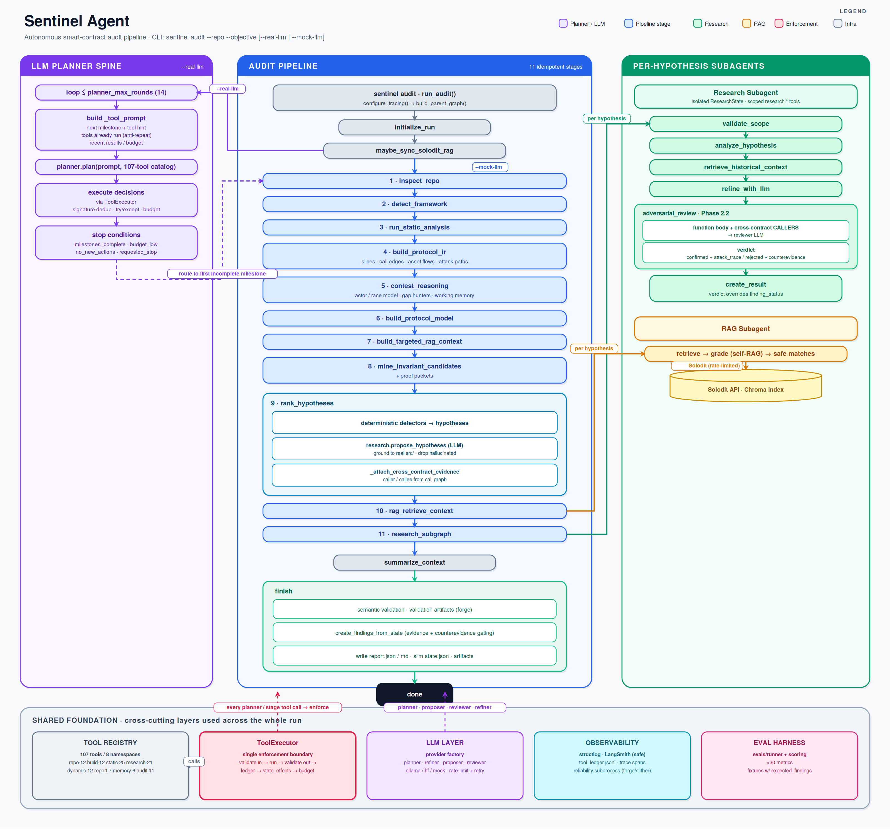

# Solidity Sentinel Memo



## What I Built

Solidity Sentinel is a production-shaped autonomous smart-contract audit agent. It combines a typed tool registry, a LangGraph parent pipeline, model-driven planning, Solodit-backed Self-RAG, scoped subagents, protocol-level intermediate representations, validation artifacts, and an evaluation harness.

The agent is run from the CLI:

```bash
sentinel audit --repo <repo> --objective "Find bugs" --real-llm
```

The result of a run is a structured artifact directory under `runs/<run_id>/` containing `report.md`, `report.json`, `state.json`, `tool_ledger.jsonl`, `working_memory.json`, `protocol_graph.json`, `candidate_rank_trace.json`, `proof_packets.json`, RAG telemetry, and validation artifacts.

The current build includes 111 tools across 8 namespaces: `repo`, `build`, `static`, `research`, `dynamic`, `report`, `memory`, and composite `audit`. Each tool is registered through one typed `RegisteredTool` abstraction and executed through a single `ToolExecutor` enforcement boundary, schema-validate input, execute, schema-validate output, record the ledger entry, apply declared state effects, and update the tool budget. This keeps the tool registry coherent at scale rather than turning the agent into a long conditional-dispatch chain.

**Measured results.** Scored against published contest findings on a recall benchmark (`sentinel benchmark`), using only a free local model (`qwen3-coder:480b` via Ollama Cloud):

| Protocol | Recall | Located (touched) | Notes |
|---|---|---|---|
| Hawk-High | **4/7 (57%)** | 5/7 | tuned during development |
| Mellow flexible-vaults | **7/15 (47%)** | 11/15 | tuned during development |
| **Sentiment v2** | **6/26 (23%)** | 14/26 | **held-out** — never seen during development |

The **Sentiment v2** number is the honest generalization baseline: a 26-finding lending protocol benchmarked only after all changes were frozen, with the ground truth built blind from the official Sherlock report. It is lower than the tuned fixtures precisely because it is unbiased — that gap is the real signal.

**Recall is architecture-bound, not model-bound.** The same fixtures score essentially identically across `qwen2.5-coder:32b`, `qwen3-coder:480b`, and frontier `claude-opus-4-8` (high-effort thinking) — Opus, at ~15× the cost and time, recovered *zero* extra findings. Every recall gain came from architectural fixes, each adding real bugs the larger models missed for the same structural reason: entry-point hypothesis targeting (recovered a High on flexible-vaults), guard-scoped adversarial rejection, per-contract proposer breadth, and a battery of deterministic detectors for recurring high-value classes (Chainlink min/max bounds, unsafe `approve`, unenforced `Pausable`) — the last of which doubled held-out recall (12%→23%). The remaining gap is dominated by **missing detector classes** (oracle-replay, ERC4626 compliance, cross-contract risk isolation) and reasoning depth on multi-step economic bugs — both addressable with more deterministic detectors rather than a bigger model.

## Architecture Overview

The parent graph is the main audit conductor. It is implemented as an 11-stage LangGraph pipeline with idempotent milestones:

```text
initialize_run
maybe_sync_solodit_rag
inspect_repo
detect_framework
run_static_analysis
build_protocol_ir
contest_reasoning
build_protocol_model
build_targeted_rag_context
mine_invariant_candidates
rank_hypotheses
rag_retrieve_context
research_subgraph
summarize_context
finish
```

The stages are deliberately ordered. First the agent understands the repository and framework. Then it extracts local source facts and builds a Protocol IR. Then it performs contest-style reasoning, mines invariants, retrieves historical context, ranks hypotheses, deepens the strongest hypotheses through RAG and research subgraphs, validates them, and writes the final report.

The important architectural choice is that the graph can run in two modes:

```text
Mock/deterministic mode:
  The pipeline runs directly through the fixed stage chain.

Real-LLM mode:
  plan_with_llm becomes the planner spine. The model receives the full tool catalog,
  schemas, risk metadata, current state summary, previous outputs, output references,
  completed milestones, remaining budget, and the next recommended milestone.
```

This gives the model real control over tool selection while the graph still protects completeness. If the planner stalls, repeats itself, or skips a required stage, the graph routes to the first incomplete milestone. That is the central reliability mechanism.

## How The LLM Planner Works

The planner loop is bounded by `planner_max_rounds`. Each round builds a planner prompt from the current `AuditState`, including:

- the objective and repo path
- the compressed context
- completed and missing milestones
- the next milestone and suggested composite tool
- the full tool catalog and JSON schemas
- previous tool outputs by reference
- Protocol IR and RAG summaries
- remaining tool budget

The LLM must return strict JSON, selected tool names, typed inputs, rationale, optional output references, and a stop/continue decision. The executor then validates that the tool exists, resolves references such as prior output paths, injects common fields like `repo_path` when safe, rejects malformed inputs, skips exact duplicate calls, executes through `ToolExecutor`, and records the result in `tool_ledger.jsonl`.

The planner is therefore model-driven but not unconstrained. It can choose tools, but it cannot bypass schema validation, budget checks, scoped registries, or required audit milestones.

## Self-RAG Flow

Solodit RAG is used as historical context and checklist guidance, never as proof of a bug in the target repo.

The global RAG cache lives under `data/rag/`:

```text
solodit_raw_cache.jsonl
solodit_normalized_findings.jsonl
sync_state.json
index_metadata.json
chroma/
```

Findings are normalized, embedded with `SENTINEL_RAG_EMBED_MODEL` (`sentence-transformers/all-MiniLM-L6-v2` by default), and indexed in Chroma. The index metadata fingerprints the embedding model to avoid silently querying an index built with a different embedding model.

For each top hypothesis, the RAG subgraph runs:

```text
expand_queries
retrieve_and_merge
maybe_repair
critique_matches
build_bundle
```

The subgraph expands one hypothesis into multiple query intents using the vulnerability class, root-cause terms, affected function, local source snippets, checklist refs, and exploit precondition terms. It retrieves across those queries, merges duplicates, grades retrieval quality, repairs weak retrieval once, critiques matches for shared root cause and exploit preconditions, and returns only `safe_to_cite` matches in a `RAGContextBundle`.

This prevents the report from citing generic "similar vault issue" matches as if they prove the local bug. Historical matches are rendered as "Historical Similar Findings" and kept separate from source evidence.

## Subagents
The research subagent receives one hypothesis at a time. It has its own `ResearchState`, a scoped research tool set, and a separate ledger. Its graph is:

```text
validate_scope
analyze_hypothesis
retrieve_historical_context
refine_with_llm
adversarial_review
create_result
```

The scope validation step ensures the subagent cannot call parent repo/write/execute tools. It analyzes local evidence, uses historical context if available, asks the LLM to refine the claim, performs adversarial review with full function bodies and cross-contract callers, and returns a structured result to the parent graph.

The RAG subgraph is also per-hypothesis and isolated around retrieval quality. Together, these subgraphs let the parent audit graph fan out into focused analysis without exposing every tool everywhere.

## Short-Term And Long-Term Memory

Short-term memory is held in `AuditState` during the run and persisted to:

```text
runs/<run_id>/working_memory.json
```

It contains Feynman-style function summaries, actor assumptions, adversarial questions, open proof obligations, rejected hypotheses, and benchmark lessons detected during the current audit.

Long-term memory is currently advisory and stored under:

```text
data/memory/benchmark_lessons.jsonl
```

At the end of a run, the parent graph extracts selected `benchmark_lessons` from the working memory and appends them to this JSONL file. Examples include lessons such as "mutable order terms require slippage or min/max bound reasoning" or "CEI-safe SafeERC20 reentrancy candidates need a concrete secondary target before promotion." These lessons are intended to guide future audits, but they cannot promote a finding without local source evidence.

The honest limitation is that long-term memory is still narrow, it stores benchmark lessons, but it is not yet a full semantic feedback loop over missed findings, false positives, successful proof templates, and future planner retrieval.

## Example Audit Flow

Suppose the user runs:

```bash
sentinel audit \
  --repo Test/2025-07-orderbook \
  --objective "Find bugs in this Foundry smart contract repo" \
  --real-llm
```

The run starts with `run_audit()`, creates `runs/<run_id>/`, configures LangSmith tracing if enabled, and builds the parent graph. The agent optionally syncs Solodit RAG, inspects the repo, detects Foundry, runs build/static tools, extracts contracts/functions/state writes/token transfers/external calls, and builds a Protocol IR.

The contest reasoning stage summarizes functions in plain English, asks adversarial questions, builds an actor/transaction model, and runs gap-hunter reasoning over flow gaps, numerical gaps, trust gaps, market/order races, and lifecycle bugs. The invariant miner turns these facts into proof-oriented candidates.

Next, targeted RAG builds a repo profile from the Protocol IR and retrieves historical Solodit context by domain, asset flow, lifecycle, auth model, and invariant family. `rank_hypotheses` merges deterministic detector outputs, invariant candidates, gap candidates, RAG checklist context, and LLM-proposed hypotheses. Ungrounded LLM proposals are dropped if they cite non-existent files/functions.

For the top hypotheses, the Self-RAG subgraph expands queries, retrieves and critiques historical matches, and attaches only safe-to-cite context. The research subagent then reviews each hypothesis with local evidence, full function bodies, cross-contract caller context, historical context, and adversarial review. The finish stage runs semantic validation, generates validation plans/tests where setup is known, compiles/runs validation artifacts, gates findings, writes reports, and persists state.

The final report is therefore not just "the model said so." It is a structured product of local evidence, ranked hypotheses, historical context, research verdicts, proof packets, and validation artifacts.

## What I Cut

I kept RAG and Chroma dependency-tolerant so the agent can still run in a minimal environment. I did not write a full Solidity parser from scratch, the current Protocol IR combines regex/range mapping, Slither output when available, and source-derived facts. That is enough for evidence grounding and useful graph slices, but it is weaker than a full AST/CFG/dataflow engine.

Most validation artifacts are still generated as plans unless constructor setup and project fixtures are clear enough to safely emit executable Foundry tests. I kept the deterministic stage chain as a fallback rather than deleting it because security tooling should fail complete and debuggable, not silently half-run when a model endpoint fails.

## What More Time Would Address

The highest-leverage next work is deeper semantic understanding, AST-backed Protocol IR, multi-hop call/dataflow, stronger actor and transaction-order modeling, and executable validation for more bug classes. The second priority is memory, persist missed findings, false-positive suppressions, successful PoC templates, and benchmark lessons into a retrievable memory layer that is fed into planning and ranking. The third priority is model quality, use a stronger hosted model for proposer/reviewer roles while keeping local/mock modes deterministic for tests. The benchmark makes this concrete: on flexible-vaults the agent *located* 67% of the bugs but *root-caused* only 33%, so the bottleneck is reasoning depth on already-surfaced functions, not surfacing — a stronger model converts that gap directly, with no architecture change.

I would also harden proof gating so `confirmed` requires either executable validation or complete static proof, improve RAG canonical query construction, and measure progress with benchmark recall rather than adding one-off detectors after each new repo.

## Design Decision I Would Defend

I would defend the hybrid design, composite `audit.*` tools plus idempotent LangGraph stages, instead of either a pure free-form ReAct loop or a rigid static pipeline.

A pure ReAct agent gives the model freedom, but it can loop, skip important setup, or produce an impressive report after an incomplete audit. A rigid pipeline is reliable, but it reduces the model to a formatter. Sentinel splits the difference: the LLM planner chooses tools and reasoning paths, while milestone guards, typed schemas, scoped subagents, ledgers, and proof gates keep the run reproducible and inspectable.

That tradeoff is especially important for security work. An autonomous auditor needs creativity, but the final report must still be traceable back to local source evidence, tool calls, and validation artifacts.
